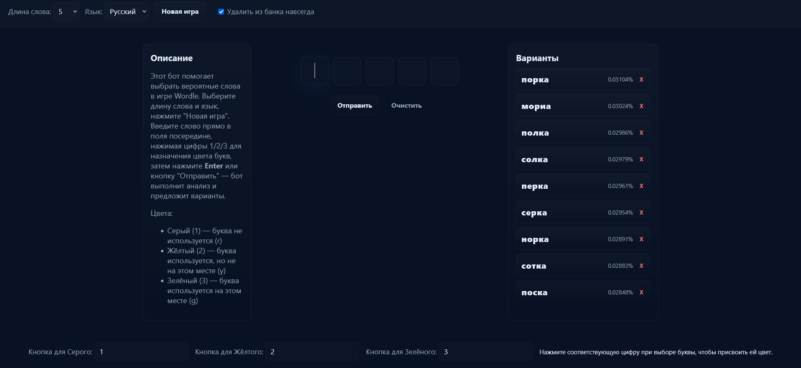

# Wordle Bot — Помощник для Wordle



Это проект, содержащий алгоритм для угадывания слов в игре Wordle. Он анализирует текущее состояние доски и предлагает слова с наивысшей вероятностью успеха. Проект включает в себя как **консольную версию**, так и современный **веб-интерфейс**.

## Возможности
- 🧠 **Умный анализ:** Рассчитывает вероятность для каждого слова на основе частотности букв и позиций.
- 🌍 **Мультиязычность:**
  - Русский язык: поддержка слов длиной от 4 до 11 букв.
  - Английский язык: классический режим (5 букв).
- 🎨 **Удобный интерфейс:**
  - Быстрый ввод цветов с клавиатуры (1/2/3 или клик мышью).
  - История введенных слов.
- 🗑️ **Управление словарем:** Возможность исключить слово из подсказок (временно или навсегда удалить из файла).

## Структура проекта

- **Запуск:**
  - `app.py` — Точка входа для **веб-версии** (Flask).
  - `main.py` — Точка входа для **консольной версии**.
- **Логика:**
  - `ui.py` — Основной класс логики игры и состояния.
  - `analyze.py` — Алгоритмы анализа слов и подсчёта весов.
  - `services/` — Сервисы для работы с сессиями (`game_store.py`) и файловой системой (`word_repo.py`).
  - `routes.py` — API эндпоинты для веб-версии.
  - `config.py` — Настройки путей и констант.
- **Данные:**
  - `word banks/` — Текстовые файлы со словарями (`english.txt`, `russian5.txt` и др.).
  - `words_uploader.py` — Загрузчик словарей в память.

## Требования
- **Python 3.10+**
- Зависимости из `requirements.txt`:
  - `Flask` (обязательно для веб-версии)

## Установка и запуск

### 1. Клонирование репозитория
```powershell
git clone https://github.com/Aetorny/wordle-bot
cd .\wordle-bot\
```

### 2. Создание виртуального окружения (рекомендуется)
```powershell
python -m venv .venv
# Windows:
.\.venv\Scripts\Activate
# Linux/Mac:
source .venv/bin/activate
```

### 3. Установка зависимостей
```powershell
pip install -r requirements.txt
```

---

### Запуск Веб-версии
Для запуска локального сервера с графическим интерфейсом:

```powershell
python app.py
```
После запуска откройте в браузере: `http://127.0.0.1:5000/`

**Как пользоваться вебом:**
1. Выберите язык и длину слова, нажмите "Новая игра".
2. Введите слово в клетки (можно также нажать на предложенное для автоподстановки).
3. Раскрасьте буквы, нажимая на них или используя цифры на клавиатуре:
   - **1**: Серый (буквы нет)
   - **2**: Жёлтый (не на своем месте)
   - **3**: Зелёный (на своем месте)
4. Нажмите Enter. Бот предложит варианты справа.

---

### Запуск Консольной версии
Для любителей минимализма и CLI:

```powershell
python main.py
```
Следуйте инструкциям в терминале.
